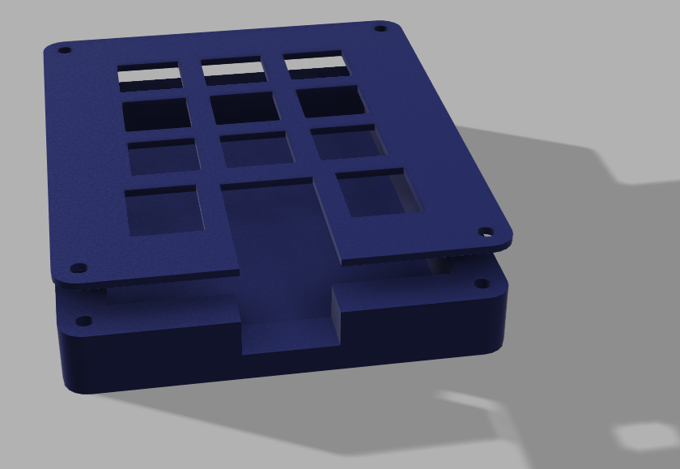

# NineKey

First attempt at making a PCB! It's got nine keys and two rotary encoders wired in a matrix.

## BOM

- SEEED XIAO RP2040 $5
- 2x EC11 Rotary Encoders $2 per
- 9 Keys ~ 50c per
- 11x D1 1N4148 Diodes

## Schematic

## PCB

## F3D Model

## Case

